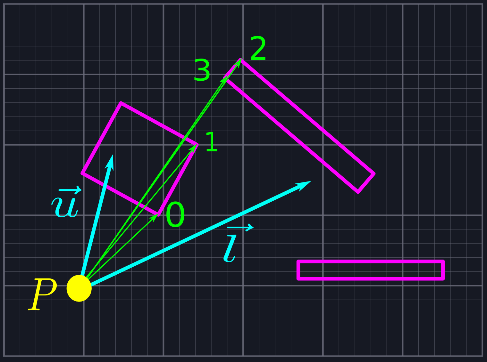
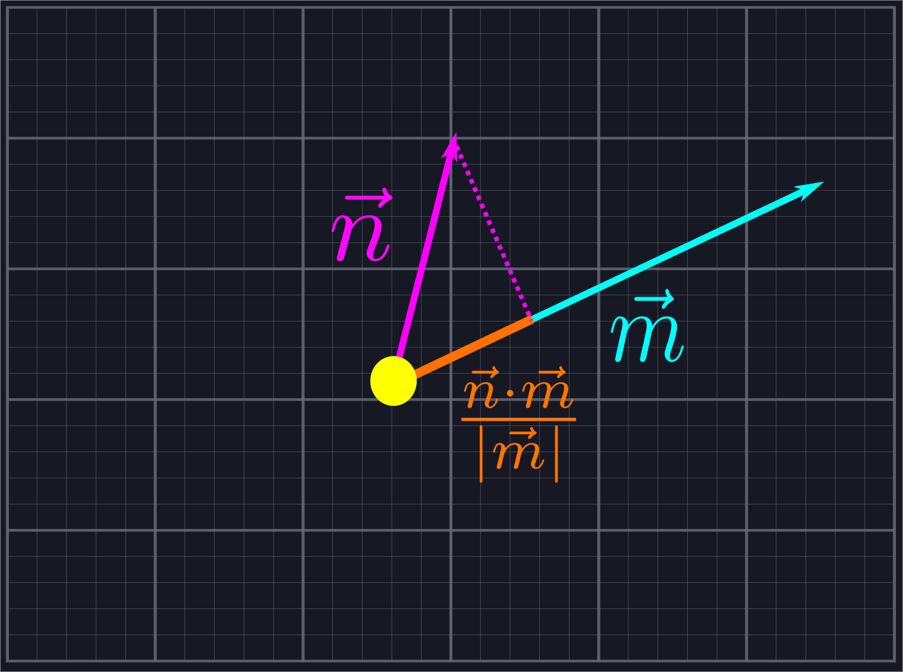
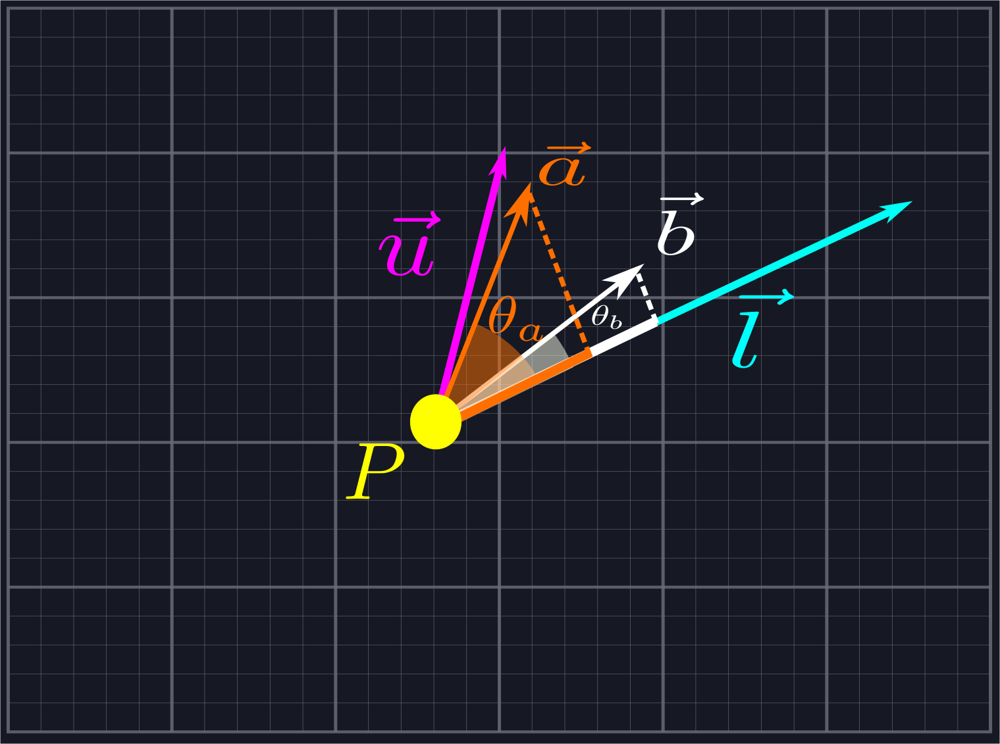

# Sortine by Angle


At this point, we've created a collection of rays emanating from \\(P\\). Our goal will be to find where these rays intersect with the line segments blocking our view, and then connect the adjacent intersection points to create a sequence of triangles which represent our field of view. To do this, we'll need to sort our collection of rays via increasing angle so that we'll know which rays are neighbors.



## Sorting by Vector Components

We're going to use dot products to avoid computing angles. Recall that, given two vectors \\(\vec{n}\\) and \\(\vec{m}\\), the component of \\(\vec{n}\\) in the direction of \\(\vec{m}\\) is given by \\(\frac{\vec{n}\cdot\vec{m}}{|\vec{m}|}\\).



Consider two of our rays defined by vectors \\(\vec{a}\\) and \\(\vec{b}\\), which we know lie between \\(\vec{l}\\) and \\(\vec{u}\\). As such, we kow that both the angle \\(\theta\_a\\) between \\(\vec{a}\\) and \\(\vec{l}\\) and the angle \\(\theta\_b\\) between \\(\vec{b}\\) and \\(\vec{l}\\) does not exceed \\(\pi\\) since the angle between \\(\vec{l}\\) and \\(\vec{u}\\) does not exceed \\(\pi\\). If all of our rays are defined by unit vectors, i.e. have length \\(1\\), we know that \\(\theta\_a\\) is larger than \\(\theta\_b\\) if and only if the component of \\(\vec{a}\\) in the direction of \\(\vec{l}\\) is *smaller* than the component of \\(\vec{b}\\) in the direction of \\(\vec{l}\\). In other words, we can sort unit vectors by increasing angle if we sort by *decreasing* components.



> We can extend this for viewing angles greater than \\(\pi\\) by also considering the components along \\(\hat{b}\_{CCW}\\). All of the rays with positive components along the normal vector come first and are sorted as described above. Then we include the rays with negative components along the normal vector, which need to be sorted in reverse. (That is, increasing components along \\(\vec{l}\\) correspond to increasing angles once we pass the angle \\(\pi\\).)

Unfortunately, most of the time our rays will not be given by unit vectors. We could compute the unit vectors, but that would require that we compute the inverse square root of the length. We could use the notorious (and notoriously opaque) [Fast Inverse Square Root Function](https://en.wikipedia.org/wiki/Fast_inverse_square_root), but we shall instead use algebra to come up with a simpler solution for the sake of clarity. Let's write down the inequality we want to check:
\\[\frac{\vec{a}\cdot\vec{l}}{|\vec{a}||\vec{l}|}>\frac{\vec{b}\cdot\vec{l}}{|\vec{b}||\vec{l}|}\\]
Here the factors of \\(|\vec{a}|\\) and \\(|\vec{b}|\\) in the denominators come from getting the components of the unit vectors in the direction of \\(\vec{a}\\) and \\(\vec{b}\\), not of \\(\vec{a}\\) and \\(\vec{b}\\) themselves. We can cancel \\(|\vec{l}|\\), leaving us with
\\[\frac{\vec{a}\cdot\vec{l}}{|\vec{a}|}>\frac{\vec{b}\cdot\vec{l}}{|\vec{b}|}\\]
We multiply to rewrite this as
\\[(\vec{a}\cdot\vec{l})|\vec{b}|>(\vec{b}\cdot\vec{l})|\vec{a}|\\]
Now, we can apply a common trick: \\(n > m\\) if and only if \\(n|n| > m|m|\\). This is because the function \\(y=x|x|=sign(x)\*x^2\\) flips the left half of the parabola \\(y=x^2\\) upside down to make it an increasing function. Thus, we can now consider the inequality
\\[(\vec{a}\cdot\vec{l})\*|\vec{a}\cdot\vec{l}|\*|\vec{b}|^2>(\vec{b}\cdot\vec{l})\*|\vec{b}\cdot\vec{l}|\*|\vec{a}|^2\\]
This is something we can represent in code using just addition and multiplication.

## Putting This Into Practice

We can calculate these quantities quite easily. Given `lower` as a `Point` as well as two `Point`s `a` and `b` that we wish to compare, we can write the following:   

```rust
{{#include ../../src/space.rs:compare}}
```

Comparing these two values and using that to sort our list of rays will be language dependent. In Rust, the `Vec` type includes the convenient `sort_by` and `sort_unstable_by` (generally the faster of the two)  methods. These allow us to pass a closure which defines an ordering on the elements for us, and the `Vec` will then sort itself according to that ordering. We'll define an associated method for the `Point` struct to do just this using the above calculations.

```rust
{{#include ../../src/space.rs:sorting_function}}
```

Here we are given a list of `Point`s which represent our rays and a `Point` for `lower`. We declare the list as mutable so that we can sort it. Then we simply call `sort_unstable_by` with our custom closure. Notice that we return `rhs.partial_cmp(&lhs)` as opposed to `lhs.partial_cmp(&rhs)`. This is making Rust reverse the order relation between the two values as discussed above. 

> The `&` and `.unwrap()` in the above code is Rust specific and is not particularly relevant to our algorithm, just necessary minutiae to make the code compile.

We again provide a test to double-check that our code works as expected.

```rust
{{#include ../../src/space.rs:sort}}
```

Applying this code to our `generate_line_of_sight` algorithm is as simple as calling our associated sorting function.

```rust
{{#rustdoc_include ../../src/sight.rs:sort}}
```

Finally, it is time to calculate where our rays intersect with our walls and form triangles to represent our line of sight.

## Potential Improvements

1. It would probably be significantly more efficient to sort the rays as they are added to our collection. We have done it afterwards for ease of explanation.
2. It may be beneficial to use the mentioned Fast Inverse Square Root Function in place of the above algebra if we do not care about readability.
