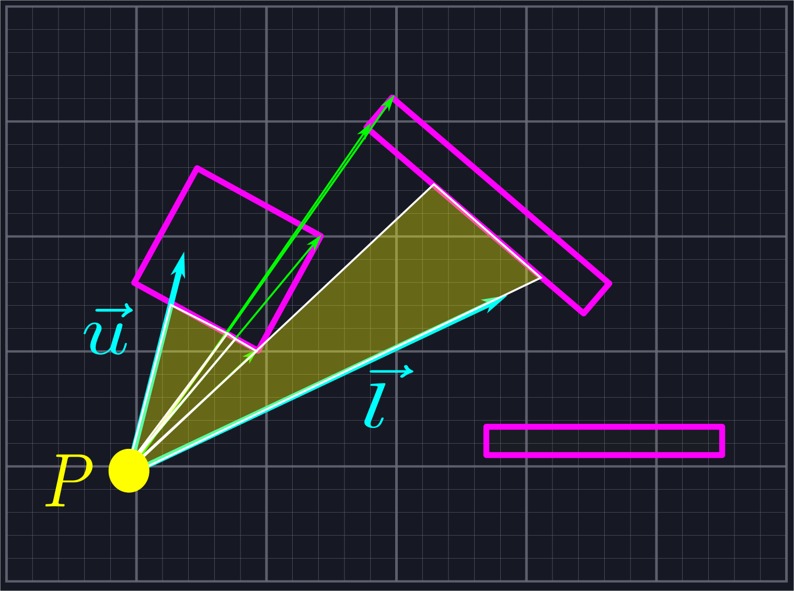

# Finding Intersection Points

Up to this point, we have used the terms vector and ray more or less interchangeably. This has been acceptable because thus far we have only cared about the direction of our rays. Now, however, we shall also need to care about how far our rays travel until they hit an obstacle, so we shall now make the distinction between the two clear. Given a vector \\(\vec{v}\\) and a point \\(P\\), the ray defined via \\(\vec{v}\\) at \\(P\\) is
\\[P+t\vec{v},\ 0\leq t<\infty\\]
In other words, the ray is an "infinite vector" which is obtained by scaling \\(\vec{v}\\) by every positive real number. 

Line segments, on the other hand, are finite pieces of lines contained between two points on the line. Given two points \\(S\\) (start) and \\(E\\) (end), we can represent the line segment \\(\vec{SE}\\) via
\\[(1-s)S+sE,\ 0\leq s\leq 1\\]
We want to figure out where (if anywhere) a given ray and a given line segment intersect.

## Raycasting

Checking rays for intersections is commonly known as raycasting, although this term is most commonly associated with its use in 3D graphics for determining which objects should be visible to a camera. Nonetheless, the principle is the same. The algebra below is nothing new, but we provide it for the sake of completeness. The algebra is not difficult, but it is symbolically intensive. It may be beneficial for some to skip to the code portion, as that is more readable.

We want to find an intersection point between a ray \\(P+t\vec{v}\\) and a line segment \\((1-s)S+sE\\). In other words, we want to compute \\(0\leq s\leq 1\\) and \\(0\leq t<\infty\\) such that
\\[P+t\vec{v}=(1-s)S+sE\\]
As we have two unknowns, we need two equations to solve for both values. Fortunately, as our vectors are two-dimensional, we can represent this as
\\[P\_x+t\vec{v}\_x=(1-s)S\_x+sE\_x\\]
and
\\[P\_y+t\vec{v}\_y=(1-s)S\_y+sE\_y\\]
In other words, we simply set the components equal to one another.

First, we solve for \\(t\\) in terms of \\(s\\) in the obvious fashion
\\[t=\frac{(1-s)S\_x+sE\_x-P\_x}{\vec{v}\_x}\text{ if }\vec{v}\_x\neq0\\]
and
\\[t=\frac{(1-s)S\_y+sE\_y-P\_y}{\vec{v}\_y}\text{ if }\vec{v}\_y\neq0\\]
So long as \\(\vec{v}\\) is not the zero vector, then we will be able to solve for \\(t\\) given \\(s\\) using at least one of the above equations.

We plug in one of the above expressions for \\(t\\) in the other equation. We shall use the \\(y\\) equation and substitute it into the \\(x\\) equation. This gives us
\\[P\_x+\frac{(1-s)S\_y+sE\_y-P\_y}{\vec{v}\_y}*\vec{v}\_x=(1-s)S\_x+sE\_x\\]
We multiply through by \\(\vec{v}\_y\\) to eliminate the denominator, yielding
\\[P\_x\vec{v}\_y+(1-s)S\_y\vec{v}\_x+sE\_y\vec{v}\_x-P\_y\vec{v}\_x=(1-s)S\_x\vec{v}\_y+sE\_x\vec{v}\_y\\]
Next, we combine the terms with an \\(s\\) on one side of the equality, and the ones without an \\(s\\) on the other:
\\[sE\_y\vec{v}\_x+sS\_x\vec{v}\_y-sS\_y\vec{v}\_x-sE\_x\vec{v}\_y=S\_x\vec{v}\_y+P\_y\vec{v}\_x-P\_x\vec{v}\_y-S\_y\vec{v}\_x\\]
So long as \\(E\_y\vec{v}\_x+S\_x\vec{v}\_y-S\_y\vec{v}\_x-E\_x\vec{v}\_y\neq0\\), we can factor out \\(s\\) from the left hand side and divide by this quantity to obtain
\\[s=\frac{S\_x\vec{v}\_y+P\_y\vec{v}\_x-P\_x\vec{v}\_y-S\_y\vec{v}\_x}{E\_y\vec{v}\_x+S\_x\vec{v}\_y-S\_y\vec{v}\_x-E\_x\vec{v}\_y}\\]

Notice that we can rewrite the denominator as
\\[E\_y\vec{v}\_x+S\_x\vec{v}\_y-S\_y\vec{v}\_x-E\_x\vec{v}\_y=(E\_y-S\_y)\vec{v}\_x+(E\_x-S\_x)(-\vec{v}\_y)=(E-S)\cdot\hat{v}\_{CCW}\\]
Therefore, the denominator is zero exactly when \\(E-S\\) and \\(\vec{v}\\) are parallel. It is safe for us to ignore this case.

> We can ignore this case because our line segments are infinitesimally thin. If a line segment parallel to our vision blocks our vision, it only blocks an infinitesimally small line behind it which cannot be represented on screen. If it is part of a larger shape, then the adjacent, non-parallel edges will act with our algorithm to block line of sight for the whole shape.

Solving for \\(t\\) is then a simple matter of plugging in the new value of \\(s\\) into our original equations for \\(t\\). This is relatively straightforward to code.

## Putting This Into Practice

Here is our complete raycasting algorithm.

```rust
{{#include ../../src/space.rs:raycast}}
```

We have defined `raycast` as a method on the `Segment` type. It returns an `Option<f32>`, which means we return a floating point number representing \\(t\\) in the above formulation if it exists, and nothing otherwise. First, we check to ensure that the given vector does not try to define the zero vector, as that does not determine a ray. Next, we compute the denominator of the above equation for \\(s\\). If it is zero, then we do not continue checking as our line segment and our ray are parallel. If it is not zero, then we compute `segment_param`, or \\(s\\), using the above equation. 

If `segment_param` is less than \\(0\\) or greater than \\(1\\), this means that our ray hits the line through `start` and `end`, but not the line segment itself. In other words, there is no intersection. If it is between these two values, we use one of the two equations above to calculate `ray_param`, or \\(t\\). If `ray_param` is negative, then there is no intersection. If it is non-negative, then there is an intersection and we return `ray_param`.

>Notice that having `ray_param` allows us to calculate the point of intersection. We return the parameter rather than the point itself because we need to be able to sort the intersection points by how far away they are.

As before, we provide some automated tests to ensure our code is working properly.

```rust
{{#include ../../src/space.rs:raycast_test}}
```

## Using Raycasting to Finish Our Algorithm

Finally, we have all of the pieces necessary to finish our line of sight algorithm. Here is the last chunk of code:

```rust
{{#rustdoc_include ../../src/sight.rs:final}}
```

>The entire function can be viewed by unhiding the remaining lines with the eye icon above.

We create a new collection to store the triangles that will represent our line of sight. We then loop through our rays, forming a triangle whose edges are the current ray, the next ray, and the closest line segment that they both hit.

>In Rust, we usually traverse a `Vec` type using an iterator rather than incrementing an index. In this case, though, we want easy access to the next item at every step and we don't want to do anything for the last ray, so we use the index to give ourselves control in a way that is more familiar to non-Rustaceans.

To find the closest line segment they both intersect with, we loop over all of our line segments and find out how far the rays travel with the `raycast` function. We ignore the line segment if one of the rays does not intersect with it, or if they intersect but it is further away than some previous one. Once we've found the closest line segment, we form our triangle. It is worth noting that because our ray vectors are not unit vectors, the result of `raycast` will not be the distance away from our point: it will be the distance scaled by the length of the vector. As we only care about comparing whether one line segment is closer than another, though, this suffices.

Finally, we have created a collection of triangles which represents our line of sight.



Here is a low-quality GIF of this algorithm in action.


The example was created using the [ggez](https://crates.io/crates/ggez) crate. Interested users can download the example from the [repository](https://github.com/basstabs/2d-line-of-sight) and build it with cargo. The world is created in the `State::new` function inside main.rs if you are interested in modifying the example. At this time, the provided code is not a crate because there is nothing that I consider ready to use out of the box. You should use the provided code as inspiration to implement your own algorithm which is optimized for your specific use case.

## Potential Improvements

1. In our `raycast` function, it is probably overkill to `panic` and halt program execution. We could just as easily return `None` or possibly make the function return a `Result<f32>` with coherent errors when there is no intersection.
2. One common technique in line of sight algorithms is to throw out extra rays very close to those which hit endpoints. (For example, as described in [[1](https://ncase.me/sight-and-light/)]) This enables us to only raycast once per line segment as opposed to twice. We have ommitted this technique for the sake of accuracy, but it is likely faster and accurate enough for most use cases.
3. Additionally, we may be able to sort the line segments by their angle from our position in such a way that we needn't loop over all of them for each ray. Such a technique is discussed in [[3](https://www.redblobgames.com/articles/visibility/)].

## Conclusion

Hopefully this has been helpful to some people. Suggestions for improving the descriptions or the code are much appreciated!
