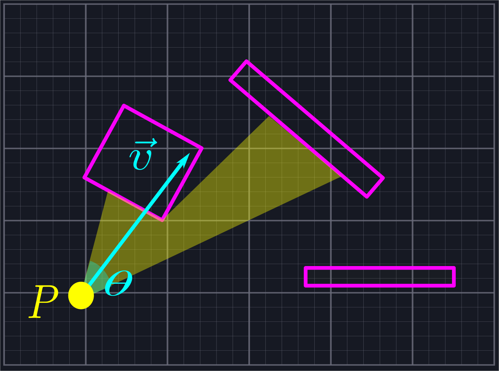
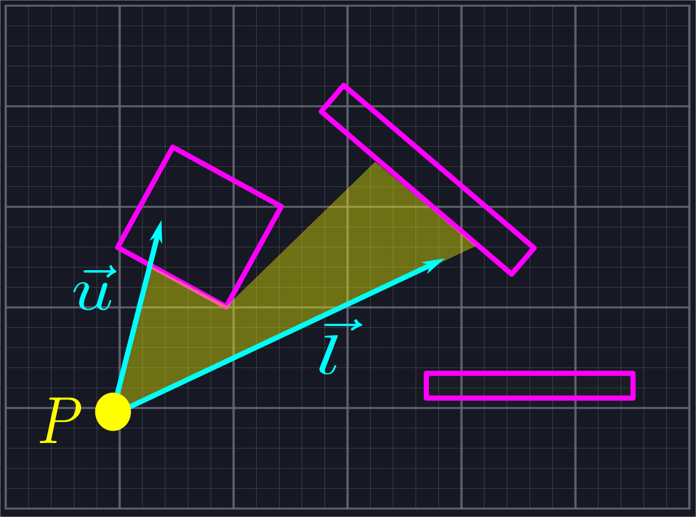

# The Problem

We are given a point \\(P\\) in space and an angle \\(0<\theta\leq\pi\\) and direction \\(\vec{v}\\). Our goal is to bound the region that can be seen from \\(P\\) while looking in the direction of \\(\vec{v}\\) with field of view \\(\theta\\). Our eyesight is not bounded by distance. (See [[2](https://legends2k.github.io/2d-fov/design.html)] for a treatment where the distance is bounded.)

As our over-arching goal is to avoid using trigonometric functions, we will not actually use an angle and viewing direction to represent the problem. Instead, we shall store two vectors which bound the viewing region: \\(\vec{l}\\) (for "lower") and \\(\vec{u}\\) (for "upper").

For our function to work, we need \\(P\\), \\(\vec{l}\\), \\(\vec{u}\\), and a list of line segments which represent all of the solid objects we can't see through. How you generate this list will depend on what shapes you are using to define your objects and which objects should and should not block vision. For the sake of efficiency, it might be worthwhile to store all static line segments (such as those coming from walls) and update only dynamic line segments (such as those coming from characters) each frame.

# Solution Outline

We shall split the problem into three discrete steps.

1. Send out rays from \\(P\\) which slice the viewing angle into triangles. 
2. Sort the rays so that the ray defined via \\(\vec{l}\\) is the least and they increase by angle towards \\(\vec{u}\\).
3. Determine how far along each ray we should travel and use that to define the triangles whose union is the visible area.

We will cover each step in its own section, first covering the math behind the code then walking through the code itself. We will also provide test code to verify that our math and code are behaving like we expect them to.
