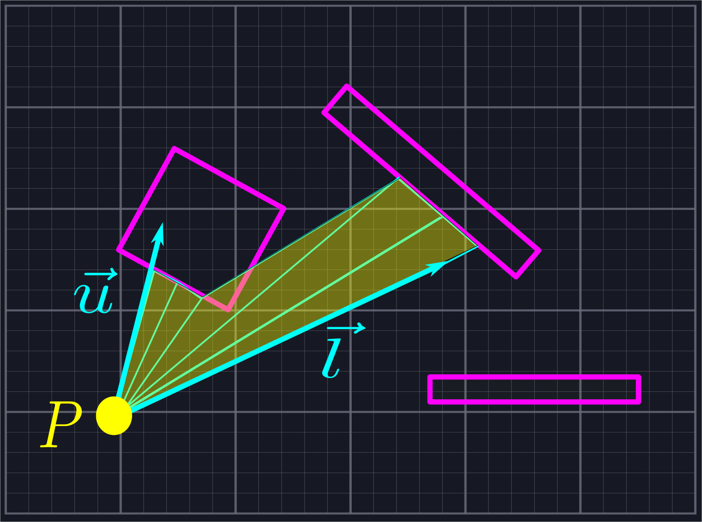
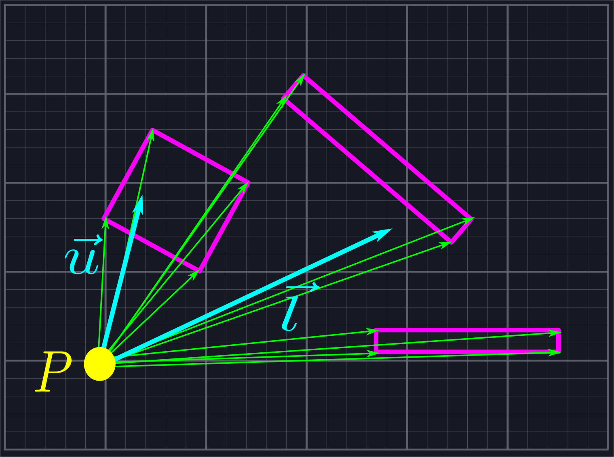
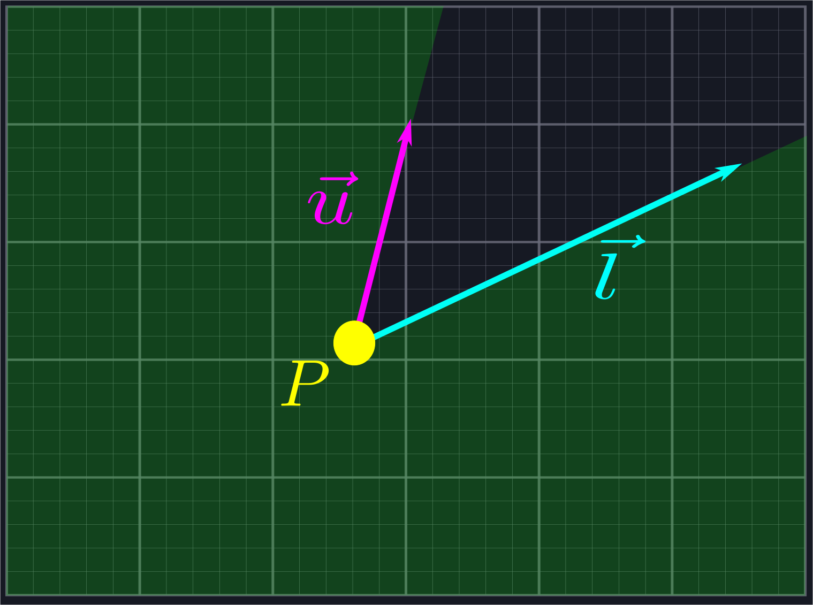
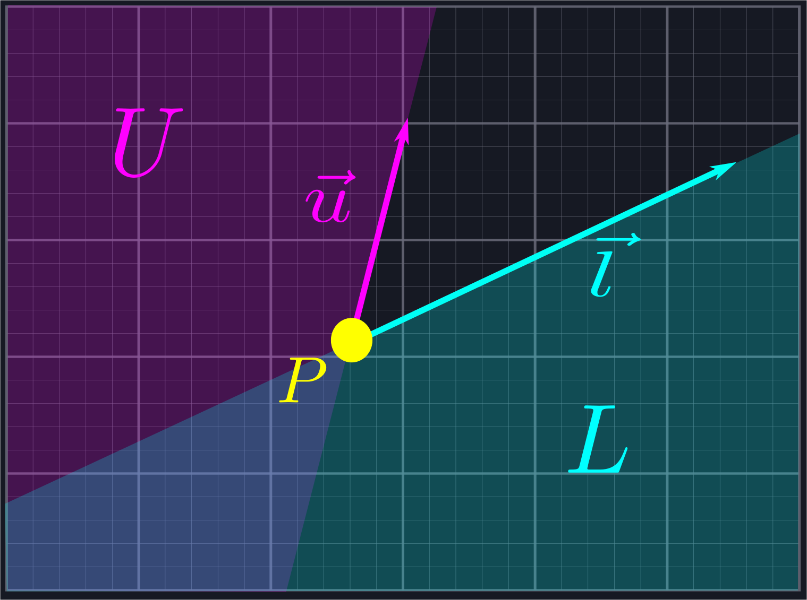
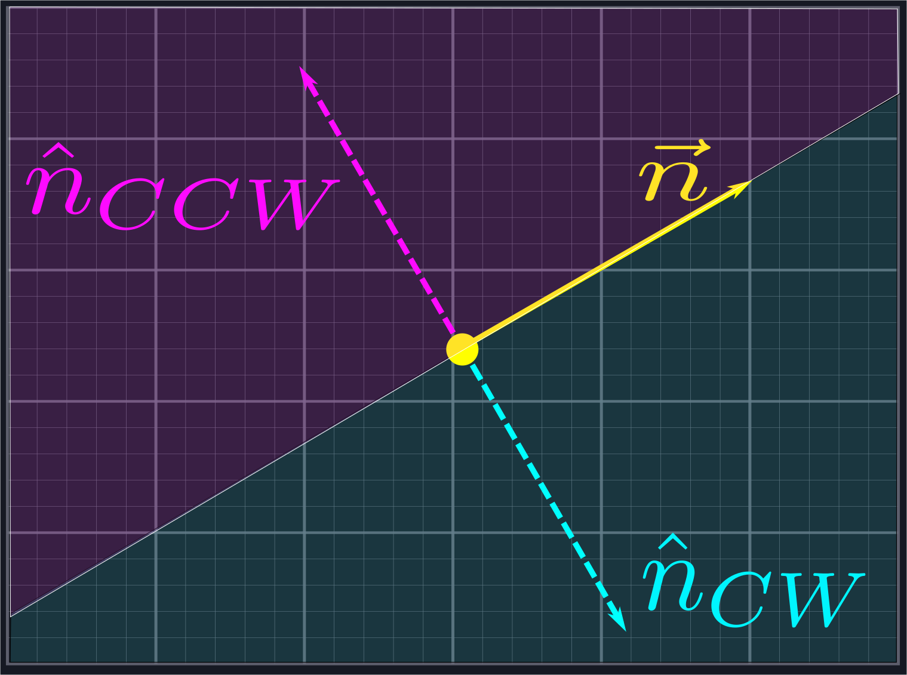
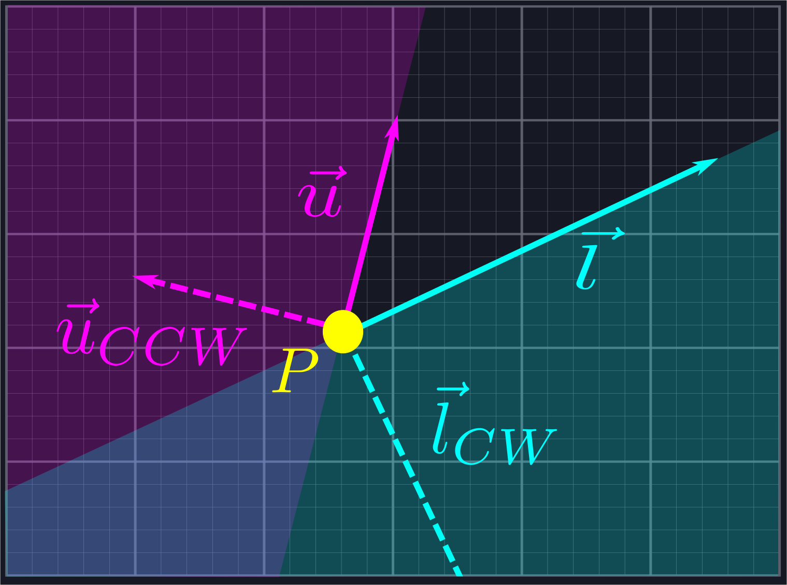

# Sending out Rays

As observed in our references, a naive initial approach to the line of sight problem is to simply cast out a large number of rays that slice our viewing area into small sections. We then measure the closest point where each ray intersects a line segment and connect the dots. 



For some use cases this approach might be good enough. However, it has a fatal flaw: the only way to improve its accuracy is to send out more and more rays. This increases the amount of computations we need to do drastically. 

Fortunately, we can be more circumspect in how we send out rays. Instead of shooting them out indiscriminately, we shall throw one in the direction of \\(\vec{l}\\), one in the direction of \\(\vec{u}\\), and one in the direction of each endpoint of each line segment. 



While this may seem at first to introduce many more rays than we need, we will be rejecting all of the rays which do not lie within our viewing area, which eliminates a large number of unnecessary calculations. In the above example, eight of the twelve rays would be rejected, leaving us only six (four endpoint rays, \\(\vec{l}\\), and \\(\vec{u}\\)) we need to perform computations with. This is the same number of rays as in the naive example shown above, but with much greater accuracy.

To do this, we need to be able to tell whether or not a ray generated in this manner is within our viewing area. If it isn't, then we should not add it to our list. The most straightforward way to do this would be to measure the angle of each ray, and determine if its angle is between the angles of \\(\vec{l}\\) and \\(\vec{u}\\). However, our goal is to implement a line of sight algorithm without resorting to expensive operations like arctangent, so we'll handle this exclusion using vectors instead.

## Rejecting Rays

We want to use vectors to reject rays which live in the shaded region below.



This region is the combination of two half-planes: the half-plane \\(L\\), which is all of the points to the right of the line defined by \\(\vec{l}\\), and the half-plane \\(U\\), which is all the points to the left of the line defined by \\(\vec{u}\\).



If a ray lies in either one of these half-planes, then we want to exclude it. We can use <i>normal</i> vectors to do this. A normal vector \\(\hat{n}\\) of a line defined via a vector \\(\vec{n}\\) is a vector which is perpendicular to the line, i.e. such that \\(\hat{n}\cdot\vec{n} = 0\\). 

> This is analgous to the normal vector of a plane in three dimensions.

Each line has two normal directions: the first, \\(\hat{n}\_{CCW}\\), is obtained by rotating \\(\vec{n}\\) by \\(\frac{\pi}{2}\\) in the counterclockwise direction, and the other, \\(\hat{n}\_{CW}\\), is obtained by rotating in the same amount in the clockwise direction. Any vector \\(\vec{a}\\) to the left of the line defined by \\(\vec{n}\\) will satisfy \\(\vec{a}\cdot\hat{n}\_{CCW}>0\\), and any vector \\(\vec{b}\\) to the right of the line defined by \\(\vec{n}\\) will satisfy \\(\vec{b}\cdot\hat{n}\_{CW}>0\\).



We can use this to reject the rays outside of our desired region. Given a vector \\(\vec{r}\\) representing one of our potential rays, we will compute \\(\hat{u}\_{CCW}\cdot\vec{r}\\) and \\(\hat{l}\_{CW}\cdot\vec{r}\\). If the first quantity is positive, then we know \\(\vec{r}\\) is inside \\(U\\). If the second quantity is positive, then we know \\(\vec{r}\\) is inside \\(L\\). In either case, it is not in the region we are looking for and we exclude it from our search. 



> For this to work, it is important that the angle between \\(\vec{l}\\) and \\(\vec{u}\\) is no larger than \\(\pi\\). However, we can process angles larger than \\(\pi\\) by applying this process to the complement angle and negating the result.

The careful reader might have an objection to this process: rotating vectors sounds like trigonometry. Fortunately, as we're only rotating by right angles, we can avoid using any trig whatsoever! Given \\(\vec{n}=\langle p,q\rangle\\), we can compute the normal vectors via \\(\hat{n}\_{CCW}=\langle-q,p\rangle\\) and \\(\hat{n}\_{CW}=\langle q,-p\rangle\\). 

> The skeptical reader can verify these facts using rotation matrices or by thinking of vectors as complex numbers and performing multiplication by \\(i\\) and \\(-i\\) respectively.

## Putting This Into Practice

Below is the actual code that handles this ray rejection  process. `Point` is a simple struct with floating point values for its components `x` and `y`. We use this struct to represent both points in space and vectors. The `ray_between` function is a member of this struct which checks if the vector is between the provided values for `upper` and `lower`. `FLOATING_POINT_ERROR` should be thought of as basically zero. 

> Floating point comparisons are a notoriously fickle issue best avoided by allowing for small amounts of error, which is why we do not compare to `0.0`. We have defined `FLOATING_POINT_ERROR` to be `0.0001`, although there is no specific rational behind this compared to other arbitrary values like `0.001` or `0.00001`. 

```rust
{{#include ../../src/space.rs:exclusion}}
```

The only pieces of this code that might cause some confusion are the dot product calculations. Rather than adding overhead by allocating new `Point`s for the normal vectors and calling the dot product function on them, we perform the calculations manually to save time. This is done using the characterization of the normal vectors described in the last paragraph of the previous section.

We write some unit tests to verify that our code is doing what we want.

```rust
{{#include ../../src/space.rs:ray_test}}
```

We now have everything we need to handle the first section of our line of sight algorithm.

```rust
{{#rustdoc_include ../../src/sight.rs:section1}}
```

We create a new vector (Rust's version of a resizable array) to store our rays in, then add `upper` and `lower` to it. From here, we iterate over each `segment` in the vector of `Segement`s which is passed into the function. `Segment` is a struct simply containing a `start` `Point` and an `end` `Point`. For each `segment`, we generate a ray between our location and both endpoints. We use `ray_between` to only accept rays which are between `upper` and `lower` in our collection.

Now we're ready to move on to the second part of our algorithm: sorting this collection of rays by angle.

## Potential Improvements

1. If your line segments define a sensible collection of closed polygons, then we can skip the second ray portion because each point should be the beginning of some line segment.
2. Before adding rays to our collection, we could additionally check to ensure that we are not adding in multiple rays which point in the same direction, as these will be redundant.
